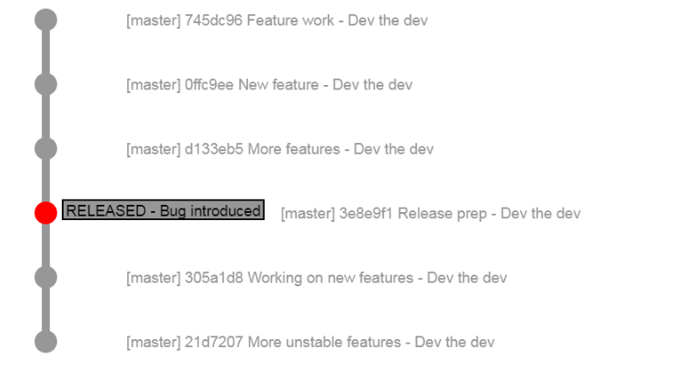
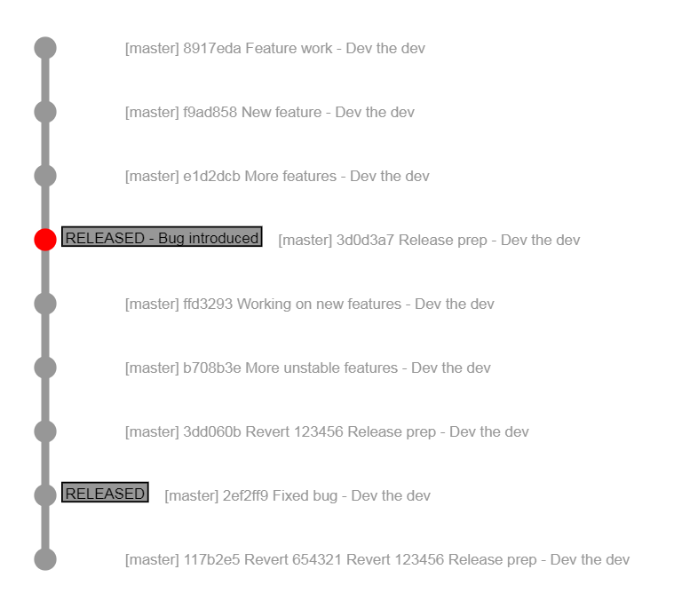

# Git Flow
## Intro and Demo

---

### Setup



Note:
- Commiting to master
- Introduce bug into production
- Several commits into unstable feature before discovery

---



Note:
- Reverting reverts
- Possible merge conflicts
- Unreadable commit history

---
# What?
Branching strategy 

First described in 2010 by Vincent Dreissen

[Blog post](https://nvie.com/posts/a-successful-git-branching-model/)

---

# Why?

1. Separates the ongoing development from finished work. 
2. Makes it easier to collaborate on features. 
3. Has a release staging area
4. Emergency fixes are more manageable


---

# How?

--- 

### The main branches

<div class="mainbranches left">

</div>

<div class="right">
    <ul>
        <li>2 Branches. Master and develop</li>
        <li>Master always reflects the production ready state</li>
        <li>Develop reflects the current work towards the next release</li>
        <li>When develop reaches a stable state <b>all</b> changes are merged into master</li>
    </ul>
</div>

Note:
- Each merge to master should represent a production release


---

### The supporting branches 

<div>
    <ul>
        <li>Feature branches</li>
        <li>Release branches</li>
        <li>Hot-fix branches</li>
        <li>(Support) branches</li>
    </ul>
</div>

Note:
- Do not talk about support branches
- All are normal git branches, just have special rules
- Short-lived

---

### Feature branches

<div class="left featurebranch">

</div>

<div class="right">
    <ul>
        <li>Used to develop new features for the next or a future release</li>
        <li>Can branch off develop or other feature branches</li>
        <li>Always merge into develop</li>
        <li>Exists for as long as the feature is in development</li>
    </ul>
</div>

Note:
- These might never be pushed to origin


---

### Creating and using a feature branch

```bash
# Create a new feature branch
$ git checkout -b feature/my-new-feature develop
#Develop your feature when ready merge your changes

$ git checkout develop
Switched to branch 'develop'

# Merge your changes into develop
$ git merge --no-ff feature/my-new-feature
Updating ...
(summary of changes)

# Delete feature branch
$ git branch -d feature/my-new-feature
Deleted branch feature/my-new-feature ...

# Push your changes to origin
$ git push origin develop

```

--- 

### Release branches

<div class="left releasebranch">

</div>
<div class="right">
    <ul>
        <li>Used to prepare a new release. Last minute bug fixes can be done on the release branch</li>
        <li>All features that are supposed to be in the release must be in develop when the branch is created</li>
        <li>Branches off develop</li>     
        <li>Must merge back into develop and master</li>
    </ul>
</div>

Note:
- Bug fixes always done on branch not on develop
- Features completed after release branch has been created **must** wait for the next release
- Merge 

--- 

### Creating and using release branches

```bash
# Create the new release branch
$ git checkout -b release/1.1 develop

# Bump any version number (if needed in your workflow)

$ ./bump-version 1.1
Version bumped to 1.1

$ git commit -a -m 'Bumped version to 1.1'

# Do any testing in the UAT environment. Any bugs discovered should be fixed # directly on the release branch, not develop.

```

---

### Finishing a release

```bash

# Merge to master

$ git checkout master
Switched to branch 'master'
$ git merge --no-ff release/1.1
...
(summary of changes)
# Tag release commit with version number for future reference
$ git tag -a 1.1

# Merge changes to develop

$ git checkout develop
$ git merge --no-ff release/1.1

# Delete release
$ git branch -d release/1.1

```

--- 

### Hotfix branches

<div class="left hotfixbranch">

</div>

<div class="right">
    <ul>
        <li>Created when there is a need to act directly on production</li>
        <li>Branches off master at the current production release</li>
        <li>Changes are merged back into master and develop (or the release branch if one exists)</li>
        <li>Allows for development to continue normally while issue is fixed</li>
    </ul>
</div>


---

### Creating a hotfix

```bash
# Create hotfix branch
$ git checkout -b hotfix/1.1.1 master

# Bump version
$ ./bump-version.sh 1.1.1
Version updated to 1.1.1
$ git commit -a -m "Bumped version to 1.1.1"

# Fix production issue
$ git commit -m "Fixed severe production problem"

# Merge changes to master
$ git checkout master
Switched to branch 'master'
$ git merge --no-ff hotfix/1.1.1
...
(Summary of changes)
$ git tag -a 1.1.1

# Merge changes to develop
$ git checkout develop 
Switched to branch 'develop'
git merge --no-ff hotfix/1.1.1
...
(Summary of changes)

# Delete hotfix branch
$ git branch -d hotfix/1.1.1
Deleted branch hotfix/1.1.1
```

---

### Making things easier

---

### Introducing the git-flow extension

```bash

$ git flow
usage: git flow <subcommand>

Available subcommands are:
   init      Initialize a new git repo with support for the branching model.
   feature   Manage your feature branches.
   bugfix    Manage your bugfix branches.
   release   Manage your release branches.
   hotfix    Manage your hotfix branches.
   support   Manage your support branches.
   version   Shows version information.
   config    Manage your git-flow configuration.
   log       Show log deviating from base branch.

Try 'git flow <subcommand> help' for details.

```

---
### git-flow feature branching

```bash

# Starting a new feature
$ git flow feature start my-feature

# Finishing feature
$ git flow feature finish my-feature

```

---

### git-flow release branching

```bash
# Creating a new release
$ git flow release start 1.1.0

# Finishing a release
$ git checkout master 
$ git checkout merge release/1.1.0
$ git flow release finish '1.1.0'

```

---

### git-flow hotfix branching

```bash

# Creating a new hotfix
$ git flow hotfix start my-hotfix

# Finishing a hotfix
$ git flow hotfix finish my-hotfix

```

---

### UI-based tools

Source-Tree

---

### Demo 1 - Using git flow in practice

---

### Demo 2 - Migrating an existing repository to git flow

---

### To recap

---

### Useful links

<div>
    <ul>
        <li>[Original blog post](https://nvie.com/posts/a-successful-git-branching-model/)</li>
        <li>[Why arent't you using git-flow](https://jeffkreeftmeijer.com/git-flow/)</li>
        <li>[git flow extension](https://github.com/nvie/gitflow)</li>
    </ul>
</div>
